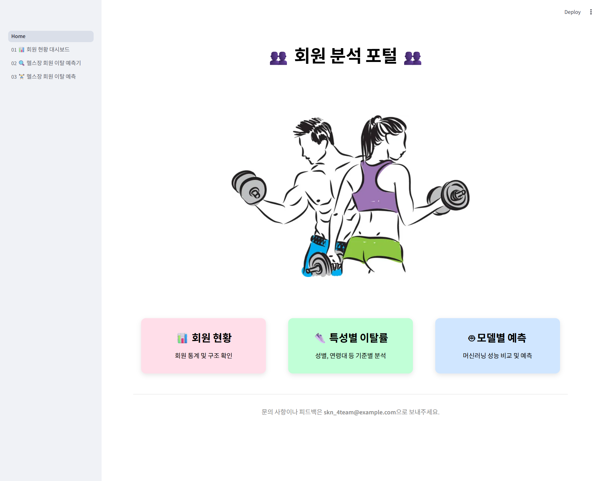
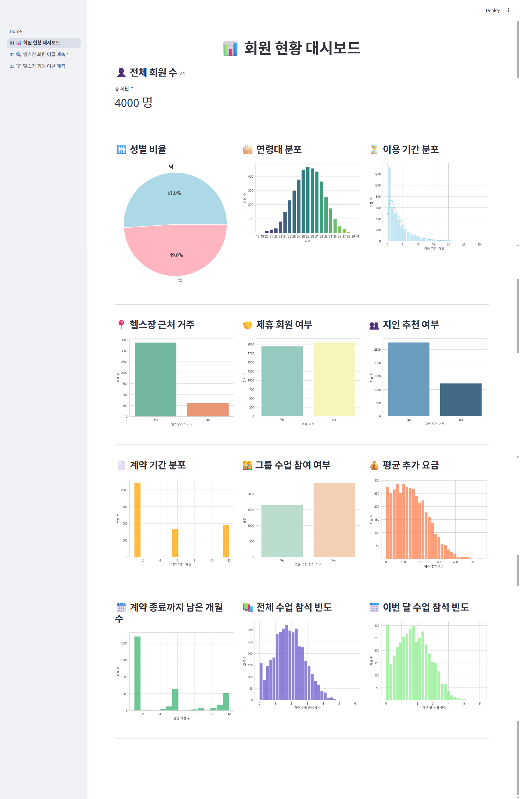
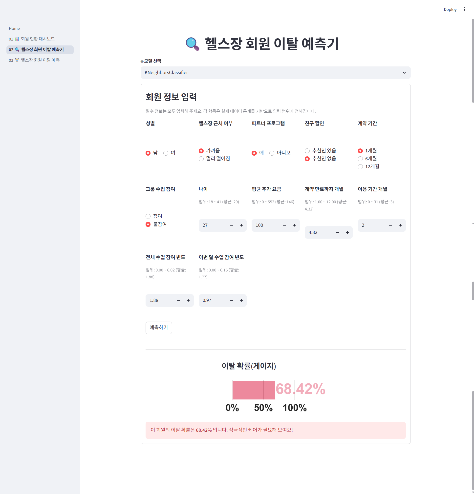
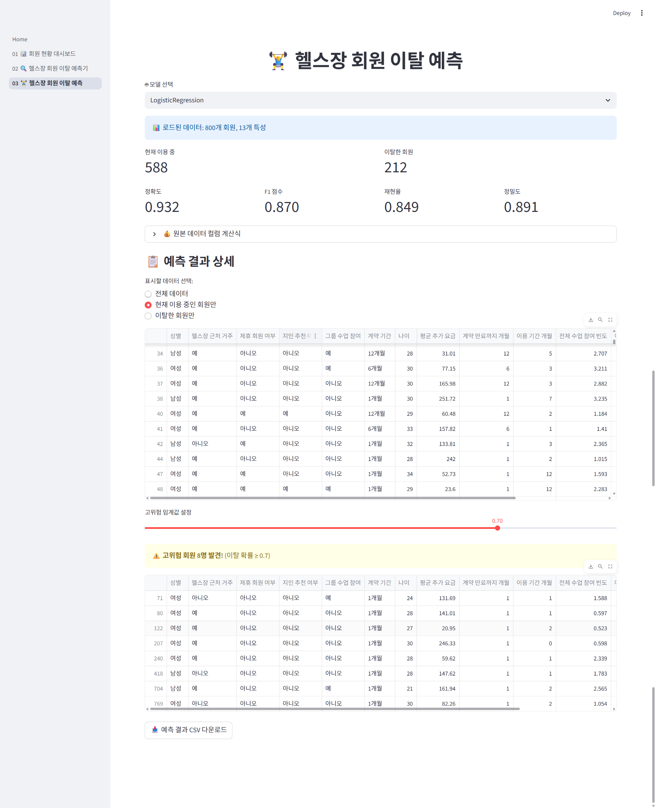

# 🏋️‍♂️헬스장 이탈 회원 분석🏋️
> **개발 기간:** 2025.06.05 ~ 2025.06.06

## 📌 목차
1. [프로젝트 개요](#1️⃣-프로젝트-개요)
2. [기술 스택](#2️⃣-기술-스택)
3. [프로젝트 산출물 구조](#3️⃣-프로젝트-산출물-구조)
4. [주요 기능](#4️⃣-주요-기능)
5. [시연 영상](#5️⃣-시연-영상)
6. [실행 방법](#6️⃣-실행-방법)
7. [프로젝트 성과 및 한계](#7️⃣-프로젝트-성과-및-한계)
8. [회고](#8️⃣-회고)
9. [그 외 관련 자료](#9️⃣-그-외-관련-자료)

## 1️⃣ 프로젝트 개요
### 1. 프로젝트 소개
본 프로젝트는 헬스장 회원 데이터를 기반으로, **이탈 고객을 사전에 예측하고 전략적으로 대응하기 위한 머신러닝 기반 모델을 구축**하는 것을 목표로 합니다.
<br>이를 통해 헬스장 운영자는 **고객 유지율을 높이고**, **마케팅 효율을 개선**할 수 있습니다.

> 핵심 목적: **회원 이탈 예측 → 맞춤형 전략 → 수익성 강화**

### 2. 필요성 및 배경
- **시장 변화**
  - 헬스장 산업이 성숙기에 접어들며 신규 회원 유치보다 **기존 고객의 이탈 방지와 충성도 관리**의 중요성이 커지고 있음

- **연구 필요성**
  - 운동 지속 의도, 서비스 만족도 등 다양한 요인이 이탈과 연결됨
  - 이를 **데이터 기반으로 분석하고 예측**하는 접근의 필요성이 대두됨

- **실무 적용 가능성**
  - 이탈 예측 모델을 통해 마케팅 전략 수립, 리텐션 프로그램 설계
  - **고객 맞춤형 서비스 제공 등 실질적인 운영 개선** 가능

### 3. 기대효과 및 전략
- **회원 이탈률 감소**
  - 이탈 가능성이 높은 고객을 조기에 식별하여 **사전 대응이 가능**해지고, 고객 유지율을 높일 수 있음

- **마케팅 비용 절감**
  - 리스크가 높은 고객군을 타겟으로 한 **집중 마케팅**이 가능해져 **불필요한 비용 낭비를 줄이고 ROI(투자수익률)를 향상**시킬 수 있음

- **데이터 기반 의사결정 정착**
  - 단순 경험이 아닌 **실제 예측 결과를 바탕으로 전략을 수립**할 수 있어 운영 효율성과 고객 관리의 정밀도가 높아짐

- **실시간 예측 시스템 구축**
  - Streamlit 기반의 예측 시스템을 통해 **현장 실무자도 쉽게 활용 가능**하며, 고객 응대 및 서비스 개선에 **즉각적인 피드백 제공** 가능

## 2️⃣ 기술 스택
| 구분 | 사용 기술 |
|------|-----------|
| 협업 & 문서화 | Discord, Notion |
| 개발 환경 | PyCharm |
| 버전 관리 | Git, GitHub |
| 프로그래밍 언어 | Python |
| 데이터 처리 · 분석 · 시각화 | Pandas, NumPy, Matplotlib, Seaborn |
| 머신러닝 & 딥러닝 | Scikit-Learn, PyTorch |
| 대시보드 / 웹 앱 | Streamlit |

## 3️⃣ 프로젝트 산출물 구조
```
📂 Gym_Churn_Analysis/
├── 📂 01_preprocessing_report/  # 데이터 전처리 결과서
├── 📂 02_training_report/       # 인공지능 학습 결과서
├── 📂 03_trained_model/         # 학습된 인공지능 모델
└── 📂 04_app/                   # Streamlit App
```

## 4️⃣ 주요 기능

### 1. 메인 페이지
> - 사용자가 전체 페이지로 쉽게 이동할 수 있도록 **카드형 UI**로 구성된 홈 화면
> - **세 가지 주요 기능(회원 현황 / 예측기 / 결과 분석)을 직관적으로 선택** 가능



### 2. 회원 현황 대시보드
> - 전체 회원 데이터의 **전반적인 분포를 시각화**하여 성별·연령대·이용 기간·추가 비용·수업 참여 패턴 등 핵심 지표를 한눈에 파악
> - 운영자가 **전체 고객군의 특성**과 **이용 흐름**을 쉽게 이해하도록 구성된 페이지



### 3. 헬스장 회원 이탈 예측기
> - 회원 정보를 입력하면 **선택한 머신러닝/딥러닝 모델 기반**으로 **이탈 확률**을 실시간 계산
> - **게이지 형태**로 **위험도를 시각적으로** 보여주어 고위험 고객 빠르게 식별



### 4. 헬스장 회원 이탈 예측 결과 분석
> - 전체 데이터와 예측 결과를 종합적으로 분석하여 **이탈 회원/유지 회원의 그룹별 통계** 비교
> - **모델 종류별 성능 지표(F1 Score, 재현율 등)** 도 함께 제공하여 운영자가 고객 관리 전략을 세울 수 있도록 구성



## 5️⃣ 시연 영상
[](https://youtu.be/9FDGJVJ8QiI)

## 6️⃣ 실행 방법
**1. 환경 설정**
> 프로젝트 실행에 필요한 모든 Python 패키지는 `requirements.txt`에 정의
```bash
pip install -r requirements.txt
```
**2. 애플리케이션 실행**
> Streamlit 기반의 웹 인터페이스는 아래 명령어로 실행
```bash
streamlit run 04_app/Home.py
```

## 7️⃣ 프로젝트 성과 및 한계
### 1. 성과
- **EDA 기반 핵심 인사이트 도출**
  - 상관계수 기반으로 주요 Feature를 선별하는 로직을 구축해 모델 학습 효율성 향상
  - 상관계수 분석을 기반으로 이탈과 밀접한 주요 변수(Lifetime, 최근 수업 참여율, 계약 기간 등) 도출

- **총 9개 모델 성능 비교 및 최적 모델(DNN) 선정**
  - 총 9개의 모델(Logistic Regression, SVC, Random Forest, XGBoost,LightGBM, KNN, Decision Tree, MLPClassifier, DNN) 학습 및 성능 실험
  - F1-score 0.8969로 가장 우수한 성능을 기록한 DNN을 최종 모델로 채택
  - Hyper Parameter Tuning 및 Scaling 조합을 통해 실질적 성능 개선 확인

- **Streamlit 기반 실시간 예측 서비스 구현**
  - 메인 페이지, 회원 현황 대시보드, 예측기, 결과 분석 등 총 4개의 페이지 UI 설계 및 구현
  - 입력값 기반 실시간 예측, 위험도 시각화, 모델 성능 비교 기능

### 2. 한계 및 개선 방향
- **데이터셋 규모 및 다양성**
  - Kaggle 제공 정형 데이터 기반이라 실제 헬스장 운영 환경을 완전히 반영하긴 어려움
  - 시간 & 행동 로그, 결제 내역, 이벤트 참여 기록 등 더 다양한 특성 활용 부재
  <br>**➡ 실사용 로그데이터 기반 확장 필요**

- **클래스 불균형**
  - 이탈률 약 26.5%로 데이터 불균형 존재
  - F1-score 중심 평가로 보완했지만 SMOTE, Focal Loss 등의 불균형 전용 기법은 미실시
  <br>**➡ 불균형 보정 기법 추가로 Recall 개선 필요**

- **모델 서빙**
  - Streamlit 기반 로컬 실행 수준이며 클라우드 배포로 나아가지는 못함
  <br>**➡ Docker 컨테이너 + AWS 기반 배포로 실서비스화 가능**

## 8️⃣ 회고
이번 프로젝트를 통해 데이터 분석부터 머신러닝 모델링까지의 흐름을 직접 경험해볼 수 있었습니다.

EDA 단계에서 변수 간 관계를 해석하고 시각화하는 작업을 진행하면서 평소 학습으로만 알고 있던 개념들이 실제 데이터에서 어떻게 작동하는지 명확히 이해하게 되었습니다.

특히 Hyper Parameter Tuning을 통해 모델 성능을 개선하는 과정이 가장 흥미로웠습니다. 단순히 모델을 선택해 적용하는 것을 넘어 어떤 조정이 어떤 영향을 미치는지 직접 확인하면서 ML의 지식들이 보다 깊이 있는 이해로 다가왔습니다. 처음엔 마냥 추상적이라고 느꼈던 ML의 기초 개념들이 점점 구체화되고 실용적인 지식으로 자리잡는 과정 속에서 더 큰 재미와 열의를 느꼈습니다.

데이터 전처리와 변수 선택 과정에서 어려움을 겪기도 했지만 이 경험을 통해 전처리 단계의 중요성과 실무적 감각의 필요성도 깨닫게 되었습니다.

다음엔 용기내서 조금 더 복잡하고 까다로운 데이터셋도 마주해보고 전처리,시각화,피처 엔지니어링 역량 등에 있어서 센스를 더 길러보고 싶습니다.

이번 프로젝트는 저에게 기술적 성장뿐 아니라 데이터 문제를 해결하는 과정 자체에서 큰 재미를 느끼게 해준 의미 있는 경험이었습니다.


## 9️⃣ 그 외 관련 자료
- [🔗 팀 프로젝트 원본 저장소](https://github.com/skn-ai14-250409/SKN14-2nd-4Team)
- [🔗 발표 자료](https://drive.google.com/file/d/1eFg3TQmWeCfFf6YsN0DBpJzEdmJ4xx-0/view?usp=sharing)
- **[📄 포트폴리오(PDF)] ### 추가 필요**